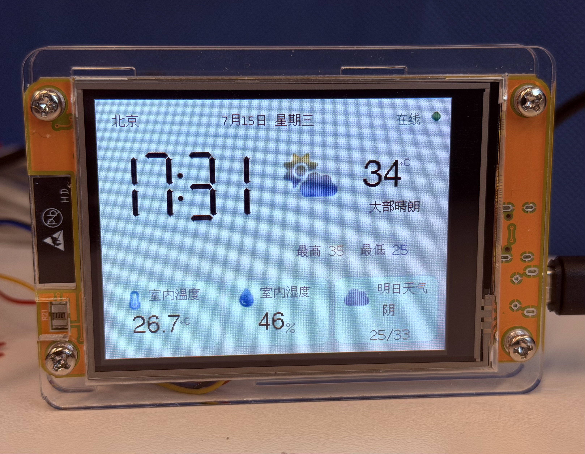

# ESP32 CYD Weather Clock

一款基于 **ESP32-2432S028R（Cheap Yellow Display）** 的中文桌面天气时钟。

A Chinese desktop weather clock for the **ESP32-2432S028R CYD**.



## Features / 功能

- 北京时间与中文日期

- 当前天气和室外温度

- 今日最高、最低温

- 明日天气预报

- SHT30/SHT31 室内温湿度

- Wi-Fi 联网与 NTP 自动校时

## Hardware / 硬件

- ESP32-2432S028R

- SHT30 or SHT31 sensor

- 5V USB power

## Wiring / 接线

| Sensor | ESP32 |
|---|---|
| VCC | 3.3V |
| GND | GND |
| SDA | GPIO 27 |
| SCL | GPIO 22 |

## Libraries / 依赖库

- TFT_eSPI

- U8g2

- U8g2_for_TFT_eSPI

- ArduinoJson

- Adafruit SHT31

## Setup / 使用方法

1. Install the required libraries.

2. Copy `User_Setup_CYD.h` settings to TFT_eSPI's `User_Setup.h`.

3. Open `ESP32_Weather_Clock.ino`.

4. Enter your Wi-Fi information:

打开 `ESP32_Weather_Clock.ino`，修改：

```cpp
const char* WIFI_NAME = "YOUR_WIFI_NAME";
const char* WIFI_PASSWORD = "YOUR_WIFI_PASSWORD";
```

请勿将真实 Wi-Fi 密码提交到公开仓库。

```text
Board: ESP32 Dev Module
Upload Speed: 115200
Partition Scheme: Huge APP
```

Files / 文件

ESP32_Weather_Clock.ino
external_icons_v12.h
User_Setup_CYD.h
README.md
LICENSE
THIRD_PARTY_LICENSES.md

Credits / 致谢

Weather data provided by Open-Meteo.
Some icons are based on Font Awesome Free.
See THIRD_PARTY_LICENSES.md for details.
License
MIT License
